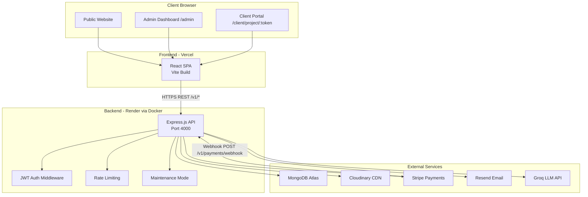
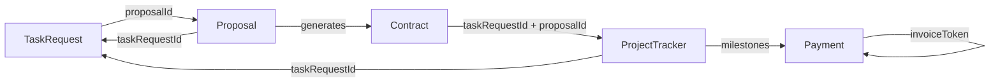
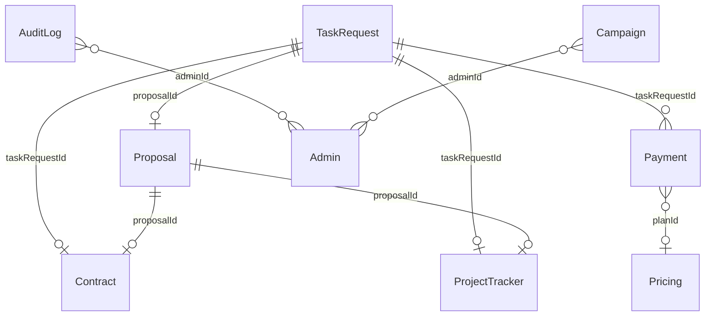

# SunTriX AI Solutions — Complete Platform Documentation

**Version:** 1.0 | **Last Updated:** June 2026 | **Author:** Platform Engineering

---

## Table of Contents

1. [Platform Overview](#1-platform-overview)
2. [Getting Started](#2-getting-started)
3. [System Architecture](#3-system-architecture)
4. [Core Modules & Features](#4-core-modules--features)
5. [Business Workflows](#5-business-workflows)
6. [Data Models (MongoDB Schemas)](#6-data-models-mongodb-schemas)
7. [API Reference](#7-api-reference)
8. [Authentication & Security](#8-authentication--security)
9. [Admin Panel Guide](#9-admin-panel-guide)
10. [Email & Notification System](#10-email--notification-system)
11. [Third-Party Integrations](#11-third-party-integrations)
12. [Deployment Guide](#12-deployment-guide)
13. [Background Jobs & Scheduler](#13-background-jobs--scheduler)
14. [Troubleshooting & FAQ](#14-troubleshooting--faq)
15. [Changelog](#15-changelog)

---

## 1. Platform Overview

### 1.1 About SunTriX AI Solutions

SunTriX AI Solutions is a **premium AI engineering agency platform** — a full-stack web application that serves as both the public-facing agency website and a complete internal operations system (CRM, project management, payments, and client portal).

**Core purpose:** A single platform that handles the entire client lifecycle — from first website visit to final project delivery and payment — without requiring any external project management tools.

**Platform type:** Marketing website + CRM + Agency Operating System  
**Primary audience:** Agency team (Admin) and external clients

### 1.2 Tech Stack

| Layer | Technology |
|---|---|
| **Frontend Framework** | React 18 (Vite) |
| **Frontend Language** | TypeScript |
| **Frontend Styling** | Tailwind CSS + shadcn/ui |
| **Frontend State** | Zustand |
| **Backend Framework** | Express.js (Node.js) |
| **Backend Language** | TypeScript |
| **Database** | MongoDB Atlas (via Mongoose) |
| **AI/LLM** | Groq (llama-3.3-70b-versatile) |
| **Payment Processing** | Stripe Checkout |
| **Email Delivery** | Resend |
| **Media/File Storage** | Cloudinary |
| **Contract Documents** | docx (Word generation) |
| **Containerization** | Docker (multi-stage Alpine build) |
| **Backend Hosting** | Render (Docker image from Docker Hub) |
| **Frontend Hosting** | Vercel (SPA via GitHub integration) |
| **DNS/Domain** | Custom domain (suntrixai.vercel.app) |

### 1.3 High-Level Architecture



---

## 2. Getting Started

### 2.1 Prerequisites

- Node.js >= 20.x
- npm >= 10.x
- Docker Desktop (for local containerized backend)
- MongoDB Atlas account (or local MongoDB)
- Accounts at: Cloudinary, Resend, Groq, Stripe

### 2.2 Local Backend Setup

```bash
# 1. Navigate to backend
cd backend

# 2. Install dependencies
npm install

# 3. Create your .env file (copy from below and fill values)
cp .env.example .env

# 4. Start the development server (with hot reload)
npm run dev
# API running at: http://localhost:4000
# Health check:   http://localhost:4000/health
```

### 2.3 Local Frontend Setup

```bash
# 1. Navigate to project root
cd suntrix-ai-solutions

# 2. Install dependencies
npm install

# 3. Create .env.local
echo "VITE_API_URL=http://localhost:4000/v1" > .env.local

# 4. Start development server
npm run dev
# Frontend running at: http://localhost:5173
```

### 2.4 First Admin Account Setup

The platform has no built-in default admin account (seed file removed). To create your first admin:

```bash
# In the backend directory, run directly via ts-node:
npx ts-node -e "
import 'dotenv/config';
import { connectDB } from './src/config/db';
import Admin from './src/models/Admin';
connectDB().then(async () => {
  await Admin.create({ email: 'admin@suntrix.com', password: 'your_secure_password', name: 'Admin', role: 'admin' });
  console.log('Admin created');
  process.exit(0);
});
"
```

Or use MongoDB Compass to insert directly into the `admins` collection.

### 2.5 Environment Variables Reference

See [Section 12.3](#123-environment-variables-full-reference) for the complete reference.

---

## 3. System Architecture

### 3.1 Request Lifecycle

Every API request follows this exact path:

```
Browser/Client
    │
    ▼ HTTPS
Vercel Edge Network (Frontend)
    │  or  │
    │       ▼ /api calls
    │  Render (Backend API)
    │       │
    │       ├─ 1. Helmet (security headers)
    │       ├─ 2. CORS Check (allowed origins list)
    │       ├─ 3. Global Rate Limiter (500 req / 15 min)
    │       ├─ 4. Maintenance Mode Check
    │       ├─ 5. Stripe Webhook Raw Body Handler
    │       ├─ 6. express.json() Body Parser (10MB limit)
    │       ├─ 7. MongoDB Sanitizer (strips $ and . from inputs)
    │       ├─ 8. Morgan Logger
    │       ├─ 9. Route Handler (JWT verified where required)
    │       ├─ 10. Controller Logic + DB Query
    │       └─ 11. Error Handler (formats all errors)
    ▼
MongoDB Atlas / Cloudinary / Stripe / Resend / Groq
```

### 3.2 Module Interaction Diagram



### 3.3 Deployment Architecture

```
Developer Machine
    │
    ├─ git push → GitHub (main branch)
    │   │
    │   └─ Vercel auto-deploys frontend
    │
    └─ docker build → docker push → Docker Hub
            │
            └─ Render pulls image → redeploys backend
```

**Backend update flow:**
1. Make code changes locally
2. `docker build -t suntrix-backend-prod .` (inside `/backend`)
3. `docker tag suntrix-backend-prod muhammadtahirsundhu/suntrix-backend:latest`
4. `docker push muhammadtahirsundhu/suntrix-backend:latest`
5. In Render dashboard → **Manual Deploy** → deploy

**Frontend update flow:**
1. Make code changes locally
2. `git add . && git commit -m "message" && git push origin main`
3. Vercel automatically detects push and redeploys (3–5 minutes)

---

## 4. Core Modules & Features

### 4.1 Authentication Module

**Purpose:** Secure admin login using JWT tokens with refresh token support.

**How it works:**
- Admin submits email/password via `POST /v1/auth/login`
- Server verifies bcrypt password hash
- Returns access token (configurable expiry, default 7 days) + refresh token (30 days)
- All admin-protected routes require `Authorization: Bearer <token>` header
- Refresh token endpoint (`POST /v1/auth/refresh`) issues new token pair
- Logout endpoint acknowledges logout (tokens are stateless; client discards them)

**Roles:** `admin` (full access) | `viewer` (read-only, limited access)

**Token invalidation:** Changing `JWT_SECRET` in Settings → Security logs out all sessions immediately.

---

### 4.2 CMS Module

**Purpose:** Dynamic website content management — eliminates the need to redeploy frontend to update website text, images, or announcements.

**How it works:** All CMS content is stored as flexible key-value documents in the `CmsContent` MongoDB collection. The frontend fetches content keys on page load. The admin updates these via the Admin → Content panel.

**CMS Keys in use:**
| Key | Description |
|---|---|
| `hero` | Homepage hero section (headline, subheadline, CTA, background image) |
| `company` | Company info (name, tagline, description, CEO details, founding year) |
| `announcement` | Floating announcement bar (text, link, visibility toggle) |
| `social_links` | Social media URLs (LinkedIn, Twitter, GitHub, etc.) |
| `seo_home` | SEO metadata for the homepage |

---

### 4.3 Portfolio & Case Studies Module

**Purpose:** Showcase completed client work on the public `/work` and `/work/:slug` pages.

**Features:**
- Rich media support (images or video per project)
- Tagging, categorization, featured flag
- SEO-friendly slugs
- Client logo, industry, measurable metric (e.g. "98% detection accuracy")
- Tool badges (tech stack per project)
- Highlight bullet points
- Draft/Published workflow with scheduled publish dates
- Drag-and-drop ordering in admin

**AI Extraction:** Admin can paste a project description and AI auto-fills all fields.

---

### 4.4 Blog / Posts Module

**Purpose:** SEO-driven blog to attract inbound traffic and demonstrate expertise.

**Features:**
- Rich HTML content (WYSIWYG via admin panel)
- Status: `draft` | `published` | `scheduled`
- Auto-publish on scheduled date (runs every 5 minutes via scheduler)
- Tags, categories, read time estimate
- Media attachments (images, videos, documents)
- View counter (incremented on public fetch)
- Featured post flag

---

### 4.5 Services / Departments Module

**Purpose:** Describes the agency's service lines on the public `/services/*` pages.

**Fields per department:**
- Name, subtitle, description, icon (Lucide icon name)
- URL slug (`href`)
- Capabilities list (6 bullet points)
- Tech stack array
- Use cases (4 items: title + description)
- Process steps (4 items: step number, title, description)
- Case study snippet (title, metric, description)
- Enabled/disabled toggle

**AI Extraction:** Admin can paste a service description and AI generates use cases, process steps, and case study in a single call.

---

### 4.6 Pricing Plans Module

**Purpose:** Dynamic pricing page (`/pricing`) where plans are managed from the admin panel.

**Key behavior:** When a visitor clicks "Get Started" on a pricing plan, they are redirected to `/request-task?plan=<planName>&budget=<price>`. These URL params are pre-filled in the task request form. The admin can then see which plan the client selected in the task request inbox.

**Fields:**
- Name, price, currency, billing period
- Description, feature list
- CTA button label and link
- `isPopular` flag (badge)
- `isVisible` toggle
- Ordering (drag-and-drop)

---

### 4.7 Team & Testimonials Module

**Team:** Manages the "Meet the Team" section on the About page.
- Name, role, department, bio
- Social links: LinkedIn, Twitter, GitHub, website
- Photo URL, visibility toggle, ordering

**Testimonials:** Client review cards shown on homepage and `/testimonials` page.
- Quote, author name, role, company
- Avatar image, star rating (1–5)
- Status: `draft` | `published`
- Featured flag (shown on homepage)

---

### 4.8 Contact & Lead Capture Module

**Purpose:** Captures website visitor messages via the contact form at `/contact`.

**Flow:**
1. Visitor fills form → `POST /v1/contact`
2. Message saved to `ContactMessage` collection
3. Email notification sent to admin email (if `EMAIL_CONTACT_NOTIFICATIONS=true`)
4. Admin reads/manages messages in Admin → Messages

**Rate limit:** 20 submissions per IP per hour.

---

### 4.9 Newsletter Module

**Purpose:** Email subscriber list management and broadcast campaigns.

**Subscriber Flow:**
1. Visitor enters name/email in newsletter widget
2. Saved to `Newsletter` collection (unique by email)
3. Admin views all subscribers in Admin → Newsletter
4. Admin can broadcast emails to all/filtered subscribers

**Campaign Broadcast:**
1. Admin writes subject + HTML body (or uses AI to generate it)
2. Clicks "Send Broadcast"
3. Backend sends via Resend in configurable batches (default 100 emails/batch)
4. Campaign is recorded in `Campaign` collection for history

**Unsubscribe:** Admin can toggle `subscribed` field per subscriber.

---

### 4.10 Task Request Module

**Purpose:** The primary client intake form — captures all details needed to start a project. This is the starting point of the entire client lifecycle.

**Public form at `/request-task` captures:**
- Client info: name, email, phone, company, role
- Project info: title, service, budget, timeline, description, priority
- Technical info: tech stack, existing code, integration requirements
- Plan info: selected plan name + budget (auto-filled from pricing page)
- Notes / additional requirements

**After submission:**
- Tracking token generated (random 40-char hex)
- Task saved with status `new`
- Admin email notification sent
- Client can track status at `/track/:token`

**Task statuses (in order):**
```
new → in_review → proposal_sent → contract_sent → contract_signed → in_progress → completed
                                                                   ↘ cancelled
```

Each status change is recorded in `statusHistory` with a timestamp and note.

---

### 4.11 Proposal Module (AI-Assisted)

**Purpose:** Admin creates and sends professional project proposals to clients.

**Admin Workflow:**
1. Admin opens a task request in Admin → Tasks
2. Clicks **"Generate with AI"** → Groq LLM drafts a complete Statement of Work
3. Admin reviews, edits the 9-section SOW form + milestone breakdown
4. Clicks **"Create & Send Proposal"**
5. Proposal saved with unique `proposalToken` and 14-day expiry
6. Client receives email with proposal link

**Client Proposal Page (`/proposal/:token`):**
- Views full proposal with milestones, timeline, scope
- Can **Accept** → triggers AI contract generation + email
- Can **Request Changes** → admin notified, task returns to `in_review`

**Proposal statuses:** `draft` | `sent` | `accepted` | `changes_requested` | `rejected`

**Proposal sections (SOW):**
- Executive Summary, Scope of Work, Deliverables
- Timeline, Milestones (with amounts in cents stored, displayed in USD)
- Pricing Breakdown, Revisions Policy
- Client Responsibilities, Support & Warranty
- Payment Terms, Next Steps

---

### 4.12 Contract Module (AI-Generated + Digital Signing)

**Purpose:** When a client accepts a proposal, an AI-generated legal contract is sent. The client signs it digitally by typing their full name.

**Automatic trigger:** When client clicks "Accept Proposal" at `/proposal/:token`, the system:
1. Calls Groq LLM to generate a full legal service agreement in plain text
2. Creates a `Contract` document with 30-day expiry
3. Updates `TaskRequest.status` to `contract_sent`
4. Emails client the contract link

**Client Contract Page (`/contract/:token`):**
- Client reads the AI-generated contract
- Types their full legal name in the signature field
- Clicks "I Agree & Sign"

**On signing:**
1. Contract marked `signed`, captures IP address + user agent (legal evidence)
2. `TaskRequest.status` → `contract_signed`
3. `ProjectTracker` automatically created (idempotent — safe to retry)
4. Admin receives email notification
5. A `.docx` Word document is generated with the signed contract + digital signature record
6. Word document emailed to **both the client and the admin**

---

### 4.13 Payment Module (Stripe Integration)

**Purpose:** Secure payment collection via Stripe Checkout for project milestones.

**Payment types:**
- `invoice` — linked to a specific task request/project milestone
- `retainer` — standalone ad-hoc payment link
- `subscription` — (type available, not fully activated)

**Invoice Creation Flow (Admin):**
1. Admin opens Admin → Payments → "Create Invoice"
2. Enters client email, amount, description, optional task ID
3. **Important:** Invoice can only be created after `contract_signed` or `in_progress` status
4. System creates `Payment` record with unique `invoiceToken`
5. Invoice email sent to client with secure payment link

**Client Invoice Page (`/invoice/:token`):**
1. Client opens link
2. Backend creates a Stripe Checkout Session dynamically
3. Client pays via Stripe's hosted checkout
4. On success: redirected to `/track/:trackingToken?paid=1`

**Stripe Webhook (`POST /v1/payments/webhook`):**
Handles these events:
- `checkout.session.completed` → marks payment as `paid`, updates TaskRequest status to `in_progress`, sends confirmation email
- `checkout.session.completed` (type: `tracker_milestone`) → marks milestone as paid in ProjectTracker
- `payment_intent.payment_failed` → marks payment as `failed`
- `charge.refunded` → marks payment as `refunded`

**Note:** The Stripe webhook endpoint MUST use a raw body parser (bypasses `express.json()`). This is handled in `app.ts` before the body parser middleware.

**Admin payment tools:**
- `/admin/list` — paginated payment history with filters
- `/admin/stats` — total revenue, pending count, refunds, this-month revenue
- `/admin/create-invoice` — create task-linked invoice
- `/admin/create-payment-link` — standalone retainer/ad-hoc link
- `/admin/refund/:id` — issue partial or full Stripe refund

---

### 4.14 Project Tracker Module

**Purpose:** Real-time project management portal. After contract signing, both admin and client access the same project through different views.

**The ProjectTracker document is the single source of truth for an active project.** It stores everything: phases, deliverables, milestones, file attachments, chat messages, and a full audit log.

**Project Phases (in order):**
`Discovery` → `Design` → `Development` → `Testing` → `Delivery`

**Key sub-entities:**

| Sub-entity | Who Manages | Who Acts |
|---|---|---|
| Phases | Admin advances | — |
| Deliverables | Admin marks InReview | Client approves/rejects |
| Milestones | Admin marks payable | Client pays via Stripe |
| Updates | Admin posts | Client acknowledges |
| Files | Admin uploads | Client approves/rejects |
| Messages | Both send | Both read |
| Audit Log | System writes | Admin reads |

**Project Completion Flow:**
1. Admin clicks "Request Completion Sign-off"
2. Client receives email with link to portal
3. Client clicks "Approve & Complete Project"
4. `TaskRequest.status` → `completed`
5. Admin receives final notification email

---

### 4.15 Clients Module

**Purpose:** Manages the "Trusted Clients" logo strip shown on the homepage.

**Fields:** Company name, logo URL, website URL, visibility toggle, ordering.

Not to be confused with "clients" as in people — this is for displaying client brand logos publicly.

---

### 4.16 Media Library (Cloudinary)

**Purpose:** Centralized file upload and deduplication system.

**How uploads work:**
1. File is received by `POST /v1/upload` (multer in-memory)
2. MD5 hash of file buffer is computed
3. If hash already exists in `MediaAsset` collection → return existing Cloudinary URL (no re-upload)
4. If new → upload to Cloudinary → save to `MediaAsset` → return URL

**Supported resource types:**
- Images: `.jpg`, `.jpeg`, `.png`, `.gif`, `.webp`, `.svg` → uploaded as `image` type
- Documents: `.pdf`, `.doc`, `.docx`, etc. → uploaded as `raw` type

**Storage structure:** Files organized into `suntrix/` folder by default (configurable via `UPLOAD_DEFAULT_FOLDER` setting).

---

### 4.17 AI Chat Module (Groq)

**Purpose:** Public AI chatbot widget on the website homepage that answers visitor questions about services, pricing, and portfolio.

**How it works:**
1. Frontend sends chat history to `POST /v1/chat`
2. Backend builds system prompt dynamically from brand settings
3. Calls Groq with `llama-3.3-70b-versatile` model
4. Returns AI-generated response

**System prompt is built dynamically from:**
- `CHATBOT_NAME` — the bot's display name
- `BRAND_NAME`, `BRAND_EMAIL` — brand identity
- `CHATBOT_MAX_WORDS` — word limit
- `CHATBOT_PRICING_LINK`, `CHATBOT_PORTFOLIO_LINK`, `CHATBOT_CONTACT_LINK` — navigation hints
- `BRAND_RESPONSE_TIME`, `BRAND_PROPOSAL_GUARANTEE` — marketing claims

**Admin override:** If `CHATBOT_SYSTEM_PROMPT` is set to a non-empty string (>50 chars), it completely replaces the auto-generated prompt.

**Rate limit:** 30 requests per minute per IP.
**Master toggle:** `AI_ENABLED = false` disables all AI endpoints.

---

### 4.18 Notifications System

The platform has no in-app notification bell. All notifications are delivered via email (Resend). See [Section 10](#10-email--notification-system) for all email templates and their triggers.

---

### 4.19 Audit Log Module

**Purpose:** Immutable, searchable record of all admin actions for accountability and debugging.

**Actions tracked:**
`create` | `update` | `delete` | `publish` | `login` | `bulk_delete` | `bulk_update` | `status_change` | `broadcast` | `reorder` | `bulk_import`

**Fields per entry:** action, entity type, entity ID, entity name, admin ID, admin name, before/after diff.

**Retention:** Configurable via `AUDIT_LOG_RETENTION_DAYS` setting. Cleaned up daily at 2 AM by the scheduler.

---

### 4.20 System Settings Module

**Purpose:** Runtime configuration of all platform settings without redeploying. Admins update API keys, brand info, and toggles via the Admin → Settings panel.

**Settings hierarchy (priority order):**
1. DB value (highest priority — set via Admin UI)
2. `.env` file value (fallback if DB value is empty)
3. Hardcoded default in `configLoader.ts` (last resort)

**Setting sections:**
| Section | Keys |
|---|---|
| `ai` | GROQ_API_KEY, GROQ_CHAT_MODEL, GROQ_EXTRACT_MODEL, temperatures, max tokens, AI_ENABLED |
| `email` | RESEND_API_KEY, ADMIN_EMAIL, FROM_EMAIL_NAME, FROM_EMAIL_ADDRESS, FRONTEND_URL, notification toggles |
| `payment` | STRIPE_SECRET_KEY, STRIPE_PUBLISHABLE_KEY, STRIPE_WEBHOOK_SECRET, STRIPE_MODE, PAYMENT_CURRENCY, INVOICE_VALIDITY_DAYS |
| `storage` | CLOUDINARY_CLOUD_NAME, CLOUDINARY_API_KEY, CLOUDINARY_API_SECRET, UPLOAD_MAX_SIZE_MB, UPLOAD_DEFAULT_FOLDER |
| `brand` | BRAND_NAME, BRAND_TAGLINE, BRAND_EMAIL, BRAND_WEBSITE, BRAND_RESPONSE_TIME, BRAND_PROPOSAL_GUARANTEE |
| `chatbot` | CHATBOT_ENABLED, CHATBOT_NAME, CHATBOT_WELCOME_MESSAGE, CHATBOT_SYSTEM_PROMPT, CHATBOT_MAX_WORDS, link settings |
| `newsletter` | NEWSLETTER_BATCH_SIZE, NEWSLETTER_FOOTER_TEXT, NEWSLETTER_DOUBLE_OPTIN |
| `security` | JWT_SECRET, JWT_EXPIRY, MAINTENANCE_MODE, RATE_LIMIT_MAX, AUDIT_LOG_RETENTION_DAYS |

**Setting types:** `text` | `password` (masked) | `toggle` (boolean) | `number` | `textarea` | `url` | `select` (dropdown)

---

## 5. Business Workflows

### 5.1 Client Onboarding Flow (Full Lifecycle)

This is the most important workflow. It covers the complete journey from lead to active project.

```
Visitor lands on website
        │
        ▼
Browses services, portfolio, pricing
        │
        ▼
Clicks "Get Started" / "Request Task"
        │
        ▼
Fills /request-task form
POST /v1/task-requests
        │
        ├─ Task saved (status: "new")
        ├─ Tracking token generated
        └─ Admin notified via email
        │
        ▼
Admin reviews in Admin → Tasks
PUT /v1/task-requests/:id/status (status: "in_review")
        │
        ▼
Admin clicks "Generate with AI"
POST /v1/proposals/admin/ai-draft
        │ (Groq writes full SOW)
        ▼
Admin reviews + edits proposal
POST /v1/proposals/admin/create
        │
        ├─ Proposal saved (status: "sent", 14-day expiry)
        ├─ TaskRequest status → "proposal_sent"
        └─ Client receives proposal email
        │
        ▼ Client opens /proposal/:token
Client reviews proposal
        │
        ├─── [Request Changes] ──────────────────────────────────────┐
        │    POST /v1/proposals/:token/request-changes               │
        │         ├─ Proposal status → "changes_requested"           │
        │         ├─ TaskRequest status → "in_review"                │
        │         └─ Admin notified, loop back to edit proposal ──────┘
        │
        └─── [Accept Proposal]
             POST /v1/proposals/:token/accept
                  │
                  ├─ Groq generates legal contract text
                  ├─ Contract saved (status: "pending", 30-day expiry)
                  ├─ TaskRequest status → "contract_sent"
                  └─ Client receives contract email
                  │
                  ▼ Client opens /contract/:token
             Client reads + signs (types full name)
             POST /v1/contracts/:token/sign
                  │
                  ├─ Contract status → "signed"
                  ├─ IP + User Agent captured
                  ├─ TaskRequest status → "contract_signed"
                  ├─ ProjectTracker auto-created
                  ├─ .docx contract generated
                  ├─ Docx emailed to client + admin
                  └─ Admin notified to create invoice
                  │
                  ▼
        [See 5.2 Payment Flow]
        [See 5.4 Project Tracking Flow]
```

---

### 5.2 Payment & Invoice Flow

```
Admin goes to Admin → Payments → "Create Invoice"
POST /v1/payments/admin/create-invoice
        │
        ├─ Validates task is contract_signed or in_progress
        ├─ Payment record created (status: "pending")
        ├─ invoiceToken generated (30-day expiry)
        └─ Invoice email sent to client
        │
        ▼ Client opens /invoice/:token
GET /v1/payments/invoice/:token
        │
        ├─ Backend checks expiry
        ├─ Creates Stripe Checkout Session
        └─ Returns checkoutUrl
        │
        ▼ Client is redirected to Stripe Checkout
Client enters card details + pays
        │
        ▼ Stripe fires webhook
POST /v1/payments/webhook
  event: checkout.session.completed
        │
        ├─ Payment status → "paid"
        ├─ TaskRequest status → "in_progress"
        ├─ Receipt URL saved
        └─ Client receives payment confirmation email
        │
        ▼ Client redirected to /track/:trackingToken?paid=1
```

---

### 5.3 Milestone Payment Flow (Via Project Tracker)

```
Admin opens project in Admin Project Hub
Admin clicks "Mark Milestone Payable" on a milestone
POST /v1/tracker/admin/:id/milestone/:mId/mark-payable
        │
        ├─ Stripe Checkout Session created (type: tracker_milestone)
        ├─ milestone.paymentRequestedAt set
        └─ Client emailed payment due notification
        │
        ▼ Client opens Project Hub /client/project/:token
Client sees "Payment Due" badge → clicks "Pay Now"
POST /v1/tracker/client/:token/milestone/:mId/checkout
        │
        └─ Returns fresh Stripe checkout URL
        │
        ▼ Stripe fires webhook
  event: checkout.session.completed (metadata.type = "tracker_milestone")
        │
        ├─ milestone.paidAt set
        ├─ Stripe PI stored on milestone
        ├─ Tracker audit log entry added
        └─ Client receives payment confirmed email
```

---

### 5.4 Project Tracking & Completion Flow

```
ProjectTracker auto-created on contract signing
Default phase: "Discovery"
        │
Admin posts updates, uploads files, adds deliverables
        │
        ▼ When deliverable is ready
Admin marks deliverable "InReview"
POST /v1/tracker/admin/:id/deliverable/:dId/complete
        │
        └─ Client emailed: "Deliverable ready for review"
        │
        ▼ Client opens portal
Client approves or rejects deliverable
        │
Admin advances project phase
POST /v1/tracker/admin/:id/phase/advance
        │
        └─ Client emailed phase advancement notification
        │
(Repeat for each phase: Discovery → Design → Development → Testing → Delivery)
        │
        ▼ All deliverables complete
Admin requests final sign-off
POST /v1/tracker/admin/:id/completion/request
        │
        └─ Client emailed completion sign-off request
        │
        ▼ Client opens portal
Client clicks "Approve & Complete Project"
POST /v1/tracker/client/:token/completion/approve
        │
        ├─ tracker.completionApprovedAt set
        ├─ TaskRequest.status → "completed"
        └─ Admin receives completion notification email
```

---

### 5.5 Newsletter Broadcast Flow

```
Admin goes to Admin → Newsletter
        │
        ├─ Views subscriber list
        └─ Clicks "New Broadcast"
        │
        ▼
Admin writes subject + HTML body
   OR clicks "Generate with AI" (prompt → Groq generates full HTML email)
        │
        ▼
Admin clicks "Send Broadcast"
POST /v1/newsletter/broadcast
        │
        ├─ Fetches all subscribed emails
        ├─ Splits into batches (NEWSLETTER_BATCH_SIZE, default 100)
        ├─ Sends each batch via Resend batch.send()
        └─ Campaign saved to Campaign collection
```

---

## 6. Data Models (MongoDB Schemas)

### 6.1 Admin

| Field | Type | Constraints | Description |
|---|---|---|---|
| `_id` | ObjectId | auto | Primary key |
| `email` | String | required, unique, lowercase | Login email |
| `password` | String | required, minlength 6 | Bcrypt hash (cost 12) |
| `name` | String | required | Display name |
| `role` | String | enum: admin/viewer | Access level |
| `createdAt` | Date | auto | Created timestamp |
| `updatedAt` | Date | auto | Last modified |

**Middleware:** Password auto-hashed via pre-save hook. Password never returned in JSON responses.

---

### 6.2 TaskRequest

| Field | Type | Constraints | Description |
|---|---|---|---|
| `_id` | ObjectId | auto | Primary key |
| `name` | String | required | Client full name |
| `email` | String | required, lowercase | Client email |
| `phone` | String | default "" | Client phone |
| `company` | String | default "" | Company name |
| `role` | String | default "" | Client's job title |
| `projectTitle` | String | default "" | Desired project name |
| `service` | String | required | Service type requested |
| `budget` | String | default "" | Stated budget range |
| `timeline` | String | default "" | Desired timeline |
| `description` | String | required | Full project brief |
| `priority` | String | default "Medium" | Urgency: Low/Medium/High |
| `techStack` | String | default "" | Preferred technologies |
| `existingCode` | String | default "No" | Has existing codebase? |
| `codeDetails` | String | default "" | Description of existing code |
| `integrations` | String | default "" | Third-party integrations needed |
| `notes` | String | default "" | Additional notes |
| `selectedPlan` | String | default "" | Plan name from pricing page |
| `planBudget` | Number | default 0 | Plan price in USD |
| `proposalId` | ObjectId → Proposal | nullable | Linked proposal |
| `contractToken` | String | sparse index | Contract token for signing |
| `contractSignedAt` | Date | nullable | When contract was signed |
| `contractClientName` | String | default "" | Digital signature (typed name) |
| `status` | String | enum (8 values) | Current pipeline stage |
| `trackingToken` | String | unique, sparse | Public status tracking token |
| `statusHistory` | Array | embedded | All status changes with notes |

**Indexes:** `status + createdAt`, `email`, `contractToken`

---

### 6.3 Proposal

| Field | Type | Description |
|---|---|---|
| `proposalToken` | String | Unique URL-safe token for client link |
| `taskRequestId` | ObjectId → TaskRequest | Source task |
| `clientName` | String | Client's display name |
| `clientEmail` | String | Client's email |
| `title` | String | Proposal title |
| `introduction` | String | Opening paragraph |
| `scopeItems` | String[] | List of scope items |
| `timeline` | String | Timeline description |
| `totalAmount` | Number | Total in cents |
| `currency` | String | ISO currency (default: "usd") |
| `milestones` | Array | [{title, description, amount (cents), dueWeek, order}] |
| `terms` | String | Payment/legal terms text |
| `executiveSummary` | String | SOW: Executive summary |
| `scopeOfWork` | String | SOW: Scope section |
| `deliverables` | String | SOW: Deliverables list |
| `pricingBreakdown` | String | SOW: Cost breakdown |
| `revisionsPolicy` | String | SOW: Revision policy |
| `clientResponsibilities` | String | SOW: Client duties |
| `supportAndWarranty` | String | SOW: Post-delivery support |
| `paymentTerms` | String | SOW: Payment structure |
| `nextSteps` | String | SOW: Kickoff instructions |
| `status` | String | draft/sent/accepted/changes_requested/rejected |
| `aiDrafted` | Boolean | Whether AI generated the draft |
| `expiresAt` | Date | 14 days after creation |
| `acceptedAt` | Date | When client accepted |
| `clientNote` | String | Client's change request note |

**Indexes:** `taskRequestId`, `clientEmail`

---

### 6.4 Contract

| Field | Type | Description |
|---|---|---|
| `contractToken` | String | Unique URL-safe token for client link |
| `taskRequestId` | ObjectId → TaskRequest | Source task |
| `proposalId` | ObjectId → Proposal | Source proposal |
| `clientName` | String | Client's name |
| `clientEmail` | String | Client's email |
| `projectTitle` | String | Project name |
| `scopeSummary` | String | Brief scope description |
| `deliverablesText` | String | Deliverables summary |
| `timelineText` | String | Timeline summary |
| `paymentTermsText` | String | Milestone payment summary |
| `revisionPolicy` | String | Revision terms |
| `warranties` | String | Warranty/liability terms |
| `governingLaw` | String | Legal jurisdiction |
| `fullContractText` | String | Complete AI-generated contract body |
| `status` | String | pending/signed/expired |
| `signedAt` | Date | Signing timestamp |
| `clientSignatureName` | String | Typed name (digital signature) |
| `clientIp` | String | Client's IP address |
| `userAgent` | String | Client's browser info |
| `expiresAt` | Date | 30 days after creation |

---

### 6.5 Payment

| Field | Type | Description |
|---|---|---|
| `stripeSessionId` | String | Stripe Checkout session ID |
| `stripePaymentIntentId` | String | Stripe PI for refunds |
| `stripeCustomerId` | String | Stripe customer ID |
| `type` | String | invoice/retainer/subscription |
| `status` | String | pending/paid/failed/refunded/cancelled |
| `amount` | Number | Amount in cents |
| `currency` | String | ISO currency |
| `clientEmail` | String | Payer's email |
| `clientName` | String | Payer's name |
| `description` | String | Payment description |
| `planId` | ObjectId → Pricing | Linked plan (if any) |
| `taskRequestId` | ObjectId → TaskRequest | Linked task (if any) |
| `invoiceToken` | String | Unique token for invoice URL |
| `trackingToken` | String | TaskRequest's tracking token |
| `receiptUrl` | String | Stripe hosted receipt URL |
| `expiresAt` | Date | Invoice expiry (30 days) |
| `refundId` | String | Stripe refund ID |
| `refundedAt` | Date | Refund timestamp |
| `refundReason` | String | Admin-provided refund reason |
| `paidAt` | Date | Payment confirmed timestamp |

**Indexes:** `clientEmail`, `status + createdAt`, `taskRequestId`

---

### 6.6 ProjectTracker

| Field | Type | Description |
|---|---|---|
| `taskRequestId` | ObjectId → TaskRequest | Source task |
| `proposalId` | ObjectId → Proposal | Source proposal |
| `trackerToken` | String | UUID for client portal URL |
| `currentPhase` | String | Active phase |
| `phases` | Array | [{name, enteredAt, completedAt, adminNote}] |
| `deliverables` | Array | [{title, status, attachedUrl, version, clientApprovedAt, clientRejectionNote}] |
| `milestones` | Array | [{title, amount (cents), linkedPhase, dueDate, paymentRequestedAt, paidAt, stripePaymentIntentId}] |
| `updates` | Array | [{type, body, postedAt, nextUpdateDue, clientAcknowledgedAt}] |
| `files` | Array | [{filename, cloudinaryUrl, cloudinaryPublicId, version, uploadedAt, approvalStatus, clientComment, approvedAt}] |
| `messages` | Array | [{sender, text, sentAt, readByClient, readByAdmin}] |
| `auditLog` | Array | [{action, actor, actorRole, timestamp, metadata}] |
| `completionRequestedAt` | Date | When admin requested sign-off |
| `completionApprovedAt` | Date | When client approved completion |

---

### 6.7 Portfolio

| Field | Type | Description |
|---|---|---|
| `title` | String | Project title |
| `slug` | String | URL-safe unique slug |
| `category` | String | Service category |
| `description` | String | Full project description |
| `shortDescription` | String | 1–2 sentence summary |
| `metric` | String | Key result (e.g. "98%") |
| `metricLabel` | String | Metric label (e.g. "Accuracy") |
| `coverImage` | String | Hero image URL |
| `thumbnailImage` | String | Card thumbnail URL |
| `images` | String[] | Gallery image URLs |
| `videoUrl` | String | Demo video URL |
| `displayType` | String | video/images |
| `liveUrl` | String | Live project URL |
| `tags` | String[] | Technology tags |
| `tools` | [{name, icon}] | Tech stack with icons |
| `clientLogo` | String | Client logo URL |
| `clientName` | String | Client company name |
| `industry` | String | Client's industry |
| `highlights` | String[] | Key achievement bullets |
| `status` | String | published/draft |
| `featured` | Boolean | Show on homepage |
| `order` | Number | Display order |
| `publishAt` | Date | Scheduled publish date |

---

### 6.8 Post (Blog)

| Field | Type | Description |
|---|---|---|
| `title` | String | Post title |
| `slug` | String | URL-safe slug |
| `excerpt` | String | Short summary |
| `content` | String | Full HTML content |
| `coverImage` | String | Cover image URL |
| `author` | String | Author name (default: "SunTriX Team") |
| `tags` | String[] | Topic tags |
| `category` | String | Post category |
| `readTimeMinutes` | Number | Estimated read time |
| `status` | String | draft/published/scheduled |
| `featured` | Boolean | Featured post flag |
| `views` | Number | View count |
| `publishAt` | Date | Scheduled date |
| `publishedAt` | Date | Actual publish date |
| `mediaAttachments` | Array | [{url, type, name, publicId, size}] |

---

### 6.9 Department (Services)

| Field | Type | Description |
|---|---|---|
| `name` | String | Department/service name |
| `subtitle` | String | Short tagline |
| `description` | String | 2-sentence description |
| `image` | String | Hero image URL |
| `href` | String | URL path (/services/slug) |
| `capabilities` | String[] | 5–6 capability bullets |
| `icon` | String | Lucide icon name |
| `useCases` | [{title, desc}] | 4 use case examples |
| `process` | [{step, title, desc}] | 4 process steps |
| `techStack` | String[] | Technologies used |
| `caseStudy` | {title, metric, desc} | Embedded case study snippet |
| `order` | Number | Display order |
| `enabled` | Boolean | Show/hide on site |

---

### 6.10 Pricing

| Field | Type | Description |
|---|---|---|
| `name` | String | Plan name |
| `price` | Number | Price in USD |
| `currency` | String | Currency code |
| `billingPeriod` | String | monthly/yearly/one-time |
| `description` | String | Plan tagline |
| `features` | String[] | Feature list |
| `isPopular` | Boolean | "Most Popular" badge |
| `isVisible` | Boolean | Show on /pricing |
| `ctaLabel` | String | Button text |
| `ctaLink` | String | Button URL |
| `order` | Number | Display order |

---

### 6.11 Team

| Field | Type | Description |
|---|---|---|
| `name` | String | Full name |
| `role` | String | Job title |
| `department` | String | Team/department |
| `bio` | String | 2–3 sentence bio |
| `imageUrl` | String | Photo URL |
| `linkedin` | String | LinkedIn URL |
| `twitter` | String | Twitter URL |
| `github` | String | GitHub URL |
| `website` | String | Personal website |
| `order` | Number | Display order |
| `isVisible` | Boolean | Show on About page |

---

### 6.12 Testimonial

| Field | Type | Description |
|---|---|---|
| `quote` | String | Review text |
| `name` | String | Client name |
| `role` | String | Client's title |
| `company` | String | Client's company |
| `avatar` | String | Profile photo URL |
| `rating` | Number | 1–5 star rating |
| `featured` | Boolean | Show on homepage |
| `status` | String | published/draft |

---

### 6.13 CmsContent

| Field | Type | Description |
|---|---|---|
| `key` | String | Unique content identifier |
| `data` | Mixed | Flexible JSON payload |
| `updatedAt` | Date | Last admin update |

---

### 6.14 ContactMessage

| Field | Type | Description |
|---|---|---|
| `name` | String | Sender's name |
| `email` | String | Sender's email |
| `company` | String | Sender's company |
| `subject` | String | Message subject |
| `message` | String | Message body |
| `read` | Boolean | Admin has read it |

---

### 6.15 Newsletter

| Field | Type | Description |
|---|---|---|
| `name` | String | Subscriber's name |
| `email` | String | Subscriber's email (unique) |
| `interest` | String | Interest category |
| `subscribed` | Boolean | Active subscription |

---

### 6.16 Campaign

| Field | Type | Description |
|---|---|---|
| `subject` | String | Email subject line |
| `htmlBody` | String | Full HTML email body |
| `targetAudience` | String | Audience filter used |
| `recipientCount` | Number | Total recipients |
| `adminId` | String | Sending admin's ID |
| `adminName` | String | Sending admin's name |
| `sentAt` | Date | Send timestamp |

---

### 6.17 AuditLog

| Field | Type | Description |
|---|---|---|
| `action` | String | Action type enum |
| `entity` | String | Entity type (e.g. "portfolio") |
| `entityId` | String | Entity's MongoDB ID |
| `entityName` | String | Human-readable name |
| `adminId` | String | Admin who performed action |
| `adminName` | String | Admin's display name |
| `diff` | Mixed | Before/after field changes |

---

### 6.18 MediaAsset

| Field | Type | Description |
|---|---|---|
| `hash` | String | MD5 hash of file (dedup key) |
| `publicId` | String | Cloudinary public_id |
| `url` | String | Cloudinary secure URL |
| `resourceType` | String | image/video/raw |
| `format` | String | File extension |
| `bytes` | Number | File size |
| `width` | Number | Image width (if applicable) |
| `height` | Number | Image height (if applicable) |
| `folder` | String | Cloudinary folder |
| `originalName` | String | Original filename |

---

### 6.19 Client (Brand Logos)

| Field | Type | Description |
|---|---|---|
| `name` | String | Company name |
| `logoUrl` | String | Logo image URL |
| `websiteUrl` | String | Company website |
| `isVisible` | Boolean | Show in logo strip |
| `order` | Number | Display order |

---

### 6.20 SystemSetting

| Field | Type | Description |
|---|---|---|
| `key` | String | Setting identifier (unique) |
| `value` | String | Current value |
| `section` | String | ai/email/payment/storage/brand/chatbot/newsletter/security |
| `label` | String | Human-readable label |
| `description` | String | Help text shown in admin |
| `type` | String | text/password/toggle/number/textarea/url/select |
| `options` | String[] | For select type: available options |
| `isSecret` | Boolean | Whether to mask in UI |
| `updatedBy` | String | Admin who last changed it |

---

### 6.21 Entity Relationship Diagram



---

## 7. API Reference

**Base URL:** `https://suntrix-backend.onrender.com/v1`  
**Local URL:** `http://localhost:4000/v1`

**Authentication:** All admin routes require:
```
Authorization: Bearer <jwt_token>
```

**Standard Error Format:**
```json
{
  "error": "Human readable error message"
}
```

---

### 7.1 Authentication

| Method | Path | Auth | Description |
|---|---|---|---|
| POST | `/auth/login` | Public | Admin login → returns token + refreshToken |
| GET | `/auth/me` | Admin | Get current admin profile |
| POST | `/auth/refresh` | Public | Refresh tokens using refreshToken |
| POST | `/auth/logout` | Admin | Acknowledge logout (client discards token) |

**POST /auth/login Request:**
```json
{ "email": "admin@suntrix.com", "password": "your_password" }
```

**POST /auth/login Response:**
```json
{
  "token": "eyJ...",
  "refreshToken": "eyJ...",
  "user": { "id": "...", "email": "admin@suntrix.com", "name": "Admin", "role": "admin" }
}
```

---

### 7.2 CMS

| Method | Path | Auth | Description |
|---|---|---|---|
| GET | `/cms/:key` | Public | Get CMS content by key |
| PUT | `/cms/:key` | Admin | Update CMS content |
| GET | `/cms/social-links` | Public | Get social media links |
| GET | `/cms/company` | Public | Get company info |
| GET | `/cms/hero` | Public | Get hero section data |
| GET | `/cms/announcement` | Public | Get announcement bar |

---

### 7.3 Portfolio

| Method | Path | Auth | Description |
|---|---|---|---|
| GET | `/portfolio` | Public | Get published projects (paginated) |
| GET | `/portfolio/:slug` | Public | Get single project by slug |
| POST | `/portfolio` | Admin | Create new project |
| PUT | `/portfolio/:id` | Admin | Update project |
| DELETE | `/portfolio/:id` | Admin | Delete project |
| PUT | `/portfolio/reorder` | Admin | Bulk reorder projects |

---

### 7.4 Task Requests

| Method | Path | Auth | Description |
|---|---|---|---|
| POST | `/task-requests` | Public (rate limited) | Submit new task request |
| GET | `/task-requests/track/:token` | Public | Get task status by tracking token |
| GET | `/task-requests` | Admin | List all tasks (filter by status) |
| GET | `/task-requests/:id` | Admin | Get single task |
| PUT | `/task-requests/:id/status` | Admin | Update task status + add history note |
| PUT | `/task-requests/:id` | Admin | General task update |
| DELETE | `/task-requests/:id` | Admin | Delete task |
| DELETE | `/task-requests/bulk` | Admin | Bulk delete tasks |

---

### 7.5 Proposals

| Method | Path | Auth | Description |
|---|---|---|---|
| POST | `/proposals/admin/ai-draft` | Admin | Generate AI proposal draft |
| POST | `/proposals/admin/create` | Admin | Create and send proposal to client |
| GET | `/proposals/admin/by-task/:taskId` | Admin | Get proposals for a task |
| GET | `/proposals/:token` | Public | Client views proposal |
| POST | `/proposals/:token/accept` | Public | Client accepts → triggers contract |
| POST | `/proposals/:token/request-changes` | Public | Client requests revisions |

---

### 7.6 Contracts

| Method | Path | Auth | Description |
|---|---|---|---|
| GET | `/contracts/:token` | Public | Client views contract |
| POST | `/contracts/:token/sign` | Public | Client signs contract digitally |
| GET | `/contracts/admin/by-task/:taskId` | Admin | Get contract for a task |

---

### 7.7 Payments

| Method | Path | Auth | Description |
|---|---|---|---|
| GET | `/payments/verify/:sessionId` | Public | Verify Stripe payment after redirect |
| GET | `/payments/invoice/:token` | Public | View invoice + get Stripe checkout URL |
| POST | `/payments/webhook` | Stripe | Stripe webhook handler (raw body) |
| GET | `/payments/admin/list` | Admin | Paginated payment history |
| GET | `/payments/admin/stats` | Admin | Revenue stats |
| POST | `/payments/admin/create-invoice` | Admin | Create project invoice |
| POST | `/payments/admin/create-payment-link` | Admin | Create standalone payment link |
| POST | `/payments/admin/refund/:id` | Admin | Issue Stripe refund |

---

### 7.8 Project Tracker (Admin)

| Method | Path | Auth | Description |
|---|---|---|---|
| GET | `/tracker/admin/list` | Admin | List all trackers |
| GET | `/tracker/admin/:id` | Admin | Get single tracker (full detail) |
| POST | `/tracker/admin/:id/phase/advance` | Admin | Advance to next phase |
| POST | `/tracker/admin/:id/deliverable/:dId/complete` | Admin | Mark deliverable as InReview |
| POST | `/tracker/admin/:id/update` | Admin | Post project update |
| POST | `/tracker/admin/:id/chat` | Admin | Send chat message to client |
| POST | `/tracker/admin/:id/milestone/:mId/mark-payable` | Admin | Create Stripe session for milestone |
| POST | `/tracker/admin/:id/file/upload` | Admin | Upload file to project |
| GET | `/tracker/admin/:id/audit` | Admin | Get project audit log |
| POST | `/tracker/admin/:id/completion/request` | Admin | Request client sign-off |

### 7.9 Project Tracker (Client — No Auth)

| Method | Path | Auth | Description |
|---|---|---|---|
| GET | `/tracker/client/:token` | Public (token) | View project portal |
| POST | `/tracker/client/:token/deliverable/:dId/approve` | Public | Approve deliverable |
| POST | `/tracker/client/:token/deliverable/:dId/reject` | Public | Reject deliverable |
| POST | `/tracker/client/:token/update/:uId/acknowledge` | Public | Acknowledge update |
| POST | `/tracker/client/:token/chat` | Public | Send chat message |
| POST | `/tracker/client/:token/file/:fId/approve` | Public | Approve file |
| POST | `/tracker/client/:token/file/:fId/reject` | Public | Reject file |
| POST | `/tracker/client/:token/milestone/:mId/checkout` | Public | Get Stripe checkout URL for milestone |
| POST | `/tracker/client/:token/completion/approve` | Public | Approve project completion |

---

### 7.10 Departments / Services

| Method | Path | Auth | Description |
|---|---|---|---|
| GET | `/departments` | Public | Get all enabled departments |
| GET | `/departments/:id` | Public | Get single department |
| POST | `/departments` | Admin | Create department |
| PUT | `/departments/:id` | Admin | Update department |
| DELETE | `/departments/:id` | Admin | Delete department |

---

### 7.11 Blog / Posts

| Method | Path | Auth | Description |
|---|---|---|---|
| GET | `/posts` | Public | Get published posts |
| GET | `/posts/:slug` | Public | Get post by slug (increments view count) |
| POST | `/posts` | Admin | Create post |
| PUT | `/posts/:id` | Admin | Update post |
| DELETE | `/posts/:id` | Admin | Delete post |

---

### 7.12 Newsletter

| Method | Path | Auth | Description |
|---|---|---|---|
| POST | `/newsletter/subscribe` | Public | Add subscriber |
| GET | `/newsletter/subscribers` | Admin | List subscribers |
| DELETE | `/newsletter/subscribers/:id` | Admin | Delete subscriber |
| POST | `/newsletter/broadcast` | Admin | Send broadcast campaign |
| GET | `/newsletter/campaigns` | Admin | Campaign history |

---

### 7.13 Contact

| Method | Path | Auth | Description |
|---|---|---|---|
| POST | `/contact` | Public (rate limited) | Submit contact form |
| GET | `/contact` | Admin | List all contact messages |
| PUT | `/contact/:id/read` | Admin | Mark message as read |
| POST | `/contact/:id/reply` | Admin | Send direct email reply |
| DELETE | `/contact/:id` | Admin | Delete message |

---

### 7.14 Pricing

| Method | Path | Auth | Description |
|---|---|---|---|
| GET | `/pricing` | Public | Get visible pricing plans |
| GET | `/pricing/admin` | Admin | Get all plans (including hidden) |
| POST | `/pricing` | Admin | Create plan |
| PUT | `/pricing/:id` | Admin | Update plan |
| DELETE | `/pricing/:id` | Admin | Delete plan |
| PUT | `/pricing/reorder` | Admin | Reorder plans |

---

### 7.15 Team

| Method | Path | Auth | Description |
|---|---|---|---|
| GET | `/team` | Public | Get visible team members |
| POST | `/team` | Admin | Create team member |
| PUT | `/team/:id` | Admin | Update team member |
| DELETE | `/team/:id` | Admin | Delete team member |

---

### 7.16 Testimonials

| Method | Path | Auth | Description |
|---|---|---|---|
| GET | `/testimonials` | Public | Get published testimonials |
| POST | `/testimonials` | Admin | Create testimonial |
| PUT | `/testimonials/:id` | Admin | Update testimonial |
| DELETE | `/testimonials/:id` | Admin | Delete testimonial |

---

### 7.17 Clients (Logo Strip)

| Method | Path | Auth | Description |
|---|---|---|---|
| GET | `/clients` | Public | Get visible client logos |
| POST | `/clients` | Admin | Add client logo |
| PUT | `/clients/:id` | Admin | Update client |
| DELETE | `/clients/:id` | Admin | Delete client |

---

### 7.18 Upload (Media Library)

| Method | Path | Auth | Description |
|---|---|---|---|
| POST | `/upload` | Admin | Upload file (multipart/form-data) |
| GET | `/upload/assets` | Admin | List all uploaded assets |
| DELETE | `/upload/:publicId` | Admin | Delete from Cloudinary + DB |

---

### 7.19 AI Chat

| Method | Path | Auth | Description |
|---|---|---|---|
| POST | `/chat` | Public (rate limited) | Send chat message, get AI response |

**Request:**
```json
{
  "messages": [
    { "role": "user", "content": "What services do you offer?" }
  ]
}
```

---

### 7.20 AI Field Extraction

| Method | Path | Auth | Description |
|---|---|---|---|
| POST | `/ai/extract` | Admin | Extract structured JSON from freeform text |

**Request:**
```json
{ "module": "portfolio", "text": "We built an inventory tracking system for RetailCo..." }
```

**Supported modules:** `portfolio`, `department`, `blog`, `team`, `pricing`, `client`

---

### 7.21 Settings

| Method | Path | Auth | Description |
|---|---|---|---|
| GET | `/settings` | Admin | Get all system settings |
| PATCH | `/settings/:key` | Admin | Update a single setting value |

---

### 7.22 Audit Logs

| Method | Path | Auth | Description |
|---|---|---|---|
| GET | `/audit` | Admin | List audit logs (filter by entity, action) |

---

### 7.23 Admin Routes

| Method | Path | Auth | Description |
|---|---|---|---|
| GET | `/admin/stats` | Admin | Platform overview stats |

---

### 7.24 Case Studies

| Method | Path | Auth | Description |
|---|---|---|---|
| GET | `/case-studies` | Public | List case studies |
| GET | `/case-studies/:slug` | Public | Get single case study |
| POST | `/case-studies` | Admin | Create case study |
| PUT | `/case-studies/:id` | Admin | Update |
| DELETE | `/case-studies/:id` | Admin | Delete |

---

## 8. Authentication & Security

### 8.1 JWT Strategy

- **Algorithm:** HS256
- **Access token expiry:** Configurable via `JWT_EXPIRY` setting (default: `7d`)
- **Refresh token expiry:** 30 days (hardcoded)
- **Refresh secret:** `JWT_SECRET + "_refresh_token_salt"` (derived, not stored separately)
- **Payload:** `{ id, email, role, name }`
- **Invalidation:** Changing `JWT_SECRET` in settings invalidates ALL existing tokens

**Middleware (`requireAuth`):**
```typescript
// Checks Authorization: Bearer <token> header
// Verifies signature + expiry
// Attaches decoded user to req.user
```

### 8.2 Rate Limiting

Three separate limiters:

| Limiter | Window | Max Requests | Applied To |
|---|---|---|---|
| Global | 15 minutes | 500 (configurable) | All routes |
| Form | 1 hour | 20 POST requests | `/task-requests`, `/contact`, `/newsletter` |
| Chat | 1 minute | 30 requests | `/chat` |

The global limit reads `RATE_LIMIT_MAX` from `configLoader` dynamically on each request — admin can change it without restart.

### 8.3 CORS Policy

Allowed origins (whitelist):
1. `process.env.FRONTEND_URL` (set in Render environment variables)
2. `http://localhost:5173` (always allowed)
3. `http://localhost:3000` (always allowed)

All other origins receive a CORS error. Requests with no `Origin` header (Postman, curl, mobile) are always allowed.

### 8.4 Additional Security

| Layer | What it does |
|---|---|
| `helmet` | Sets 14 HTTP security headers (CSP, HSTS, X-Frame, etc.) |
| `express-mongo-sanitize` | Strips `$` and `.` from req.body, query, params to prevent NoSQL injection |
| `bcryptjs` (cost 12) | One-way password hashing |
| Maintenance Mode | Returns 503 for all public routes when `MAINTENANCE_MODE=true` |
| Admin bypass | Admin routes, `/health`, and authenticated requests bypass maintenance mode |

---

## 9. Admin Panel Guide

**URL:** `https://suntrixai.vercel.app/admin`

### 9.1 Login Page (`/admin`)

- Enter admin email and password
- On success: JWT stored in `localStorage` and Zustand state
- Token auto-refreshed before expiry

### 9.2 Dashboard (`/admin/dashboard`)

Overview stats: total tasks, active projects, revenue this month, unread messages.

### 9.3 Tasks (`/admin/tasks`)

**The core operations hub.** Lists all task requests grouped by status.

- View full task brief
- Update status with optional note
- **Generate AI Proposal Draft** → opens proposal editor pre-filled by AI
- Send proposal to client
- View proposal acceptance status

### 9.4 Proposals Panel

- Lists all proposals with status
- Edit and resend
- View client's change request notes
- Proposal URL visible for manual sharing

### 9.5 Contracts Panel

- View signed contracts
- See IP address + user agent (legal evidence)
- View digital signature

### 9.6 Project Hub (`/admin/tasks` → tracker view)

The project management view for active projects:

- Phase advancement
- Deliverable management
- File uploads
- Update posting
- Chat with client
- Milestone payment management
- Request completion sign-off
- Audit log

### 9.7 Payments (`/admin/payments`)

- View all payment history
- Filter by status (pending/paid/failed/refunded)
- Create invoice for task
- Create ad-hoc payment link
- Process refunds
- View revenue stats

### 9.8 Blog (`/admin/blog`)

- Create/edit/delete blog posts
- AI writing assistant
- Schedule publish dates
- Manage media attachments

### 9.9 Portfolio (`/admin/portfolio`)

- Create/edit/delete portfolio projects
- AI auto-fill from description
- Drag-and-drop ordering
- Upload cover images + galleries

### 9.10 Clients (`/admin/clients`)

- Manage client logo strip
- Upload logos, add website URLs
- Toggle visibility per logo

### 9.11 Messages (`/admin/messages`)

- View all contact form submissions
- Mark as read
- Send direct email reply

### 9.12 Newsletter (`/admin/newsletter`)

- Subscriber management
- Export subscriber list
- AI-powered email template generator
- Broadcast campaign with preview

### 9.13 Media Library (`/admin/media`)

- Browse all uploaded Cloudinary assets
- Upload new files
- Delete assets (removes from Cloudinary + DB)
- Copy URL

### 9.14 Team (`/admin/team`)

- Add/edit/delete team members
- Upload photos
- Toggle visibility

### 9.15 Departments (`/admin/departments`)

- Manage service departments
- AI auto-fill for use cases and process steps
- Enable/disable per department

### 9.16 Pricing (`/admin/pricing`)

- Add/edit/delete pricing plans
- Toggle visibility and "popular" badge
- Drag-and-drop ordering

### 9.17 Settings (`/admin/settings`)

- Organized into 8 sections (AI, Email, Payment, Storage, Brand, Chatbot, Newsletter, Security)
- Changes take effect immediately without server restart
- Secret fields masked in UI

### 9.18 Audit Log (`/admin/audit-log`)

- Complete admin action history
- Filter by entity type, action type, date range
- Shows diff for update actions

### 9.19 Content (`/admin/content`)

- Edit homepage hero section
- Edit company information
- Manage announcement bar
- Edit social links
- SEO metadata

---

## 10. Email & Notification System

All emails are sent via **Resend** using the `FROM_EMAIL_ADDRESS` setting (must be verified in Resend).

### 10.1 Email Templates (Complete List)

| Function | Trigger | Recipient | Subject |
|---|---|---|---|
| `sendContactNotification` | Contact form submitted | Admin | `[SunTriX] New Contact: {subject}` |
| `sendTaskNotification` | Task request submitted | Admin | `[SunTriX] New Task Request: {title}` |
| `sendProposalEmail` | Admin creates proposal | Client | `📋 Proposal from SunTriX — {title}` |
| `sendChangesRequestedNotification` | Client requests changes | Admin | `Proposal Changes Requested — {project}` |
| `sendContractEmail` | Client accepts proposal | Client | `📄 Service Agreement Ready — {project}` |
| `sendContractSignedNotification` | Client signs contract | Admin | `✅ Contract Signed — {project}` |
| `sendSignedContractEmail` | Contract signed | Both (client + admin) | `📄 Signed Contract — {project}` + .docx attachment |
| `sendInvoiceEmail` | Admin creates invoice | Client | `Invoice from SunTriX — {description}` |
| `sendPaymentConfirmation` | Stripe webhook: payment paid | Client | `✅ Payment Confirmed — SunTriX` |
| `sendNewsletterBroadcast` | Admin sends campaign | All subscribers | Admin-defined subject |
| `sendDirectReply` | Admin replies to message | Contact sender | Admin-defined subject |
| `sendTrackerPhaseAdvancedEmail` | Admin advances phase | Client | `Project Update: Now in {phase}` |
| `sendTrackerDeliverableReviewEmail` | Admin marks deliverable InReview | Client | `Action Required: Review Deliverable` |
| `sendTrackerUpdateEmail` | Admin posts update | Client | `New Update on {project}` |
| `sendTrackerFileEmail` | Admin uploads file | Client | `New File Shared: {filename}` |
| `sendTrackerPaymentDueEmail` | Admin marks milestone payable | Client | `Invoice Ready: {milestone}` |
| `sendTrackerPaymentConfirmedEmail` | Stripe webhook: milestone paid | Client | `Payment Received: {milestone}` |
| `sendTrackerClientActionToAdminEmail` | Client approves/rejects anything | Admin | `Client {action} — {project}` |
| `sendTrackerCompletionRequestEmail` | Admin requests sign-off | Client | `✅ Your Project is Ready for Final Sign-Off` |
| `sendTrackerCompletionApprovedEmail` | Client approves completion | Admin | `🏆 Project Completed & Approved` |

### 10.2 Email Configuration Toggles

| Setting | Default | Description |
|---|---|---|
| `EMAIL_CONTACT_NOTIFICATIONS` | true | Enable/disable contact form admin emails |
| `EMAIL_TASK_NOTIFICATIONS` | true | Enable/disable task request admin emails |

### 10.3 The Signed Contract Document

When a contract is signed, the platform generates a Word (.docx) document containing:
1. Full AI-generated contract text
2. Digital Signature Record section:
   - Client's typed name
   - Client's email
   - Signature date/time
   - IP address
   - Browser user agent

This document is emailed to both the client and the admin simultaneously.

---

## 11. Third-Party Integrations

### 11.1 Stripe

**Purpose:** All payment processing.

**Setup:**
1. Create Stripe account at dashboard.stripe.com
2. Get Secret Key (`sk_test_...` or `sk_live_...`)
3. Create Webhook endpoint pointing to `https://your-backend/v1/payments/webhook`
4. Select events: `checkout.session.completed`, `payment_intent.payment_failed`, `charge.refunded`
5. Copy Webhook Secret (`whsec_...`)
6. Add all three to Settings → Payment in Admin panel

**Key behaviors:**
- Always uses Stripe Checkout (hosted page) — never custom card form
- Raw body required for webhook signature verification
- Supports partial and full refunds via admin panel
- Milestone payments tracked by metadata (`type: "tracker_milestone"`)

---

### 11.2 Cloudinary

**Purpose:** All file uploads and media storage.

**Setup:**
1. Create Cloudinary account at cloudinary.com
2. From Dashboard, copy: Cloud Name, API Key, API Secret
3. Add to Settings → Storage in Admin panel

**Upload deduplication:** The platform MD5-hashes every file before uploading. If the same file has been uploaded before (in any folder), the existing Cloudinary URL is returned instantly.

**Upload limits:** Configurable via `UPLOAD_MAX_SIZE_MB` (default 50MB).

---

### 11.3 Resend

**Purpose:** All transactional and broadcast emails.

**Setup:**
1. Create account at resend.com
2. Verify your sender domain (or use `onboarding@resend.dev` for testing)
3. Create API key
4. Add to Settings → Email in Admin panel
5. Set `FROM_EMAIL_ADDRESS` to your verified domain email

**Important:** On free Resend plans, you can only send to emails you've verified. Full broadcast capability requires a paid plan or a verified domain.

---

### 11.4 Groq

**Purpose:** AI features — chatbot, proposal drafting, contract generation, field extraction, email template generation.

**Setup:**
1. Create account at console.groq.com
2. Create API key (`gsk_...`)
3. Add to Settings → AI in Admin panel

**Models used:**
| Task | Default Model |
|---|---|
| Chatbot responses | `llama-3.3-70b-versatile` |
| Field extraction | `llama-3.1-8b-instant` |
| Email template generation | `llama-3.3-70b-versatile` |
| Proposal drafting | `llama-3.1-8b-instant` |
| Contract generation | `llama-3.3-70b-versatile` |

All models are configurable from Admin → Settings → AI.

**AI Features Master Toggle:** Set `AI_ENABLED = false` in Settings to disable all AI endpoints without code changes.

---

## 12. Deployment Guide

### 12.1 Backend — Docker + Render

**Build process (multi-stage Docker):**

```
Stage 1 (Builder):
  node:20-alpine
  npm install (all dependencies)
  tsc (TypeScript → JavaScript in /dist)

Stage 2 (Production):
  node:20-alpine (fresh, minimal)
  USER node (non-root security)
  npm install --omit=dev (production only)
  COPY /dist from builder
  EXPOSE 4000
  CMD ["node", "dist/app.js"]
```

**Deploy new version:**
```bash
cd backend
docker build -t suntrix-backend-prod .
docker tag suntrix-backend-prod muhammadtahirsundhu/suntrix-backend:latest
docker push muhammadtahirsundhu/suntrix-backend:latest
```
Then in Render: **Manual Deploy** → pull latest image.

**Render Environment Variables to set:**
```
NODE_ENV=production
PORT=4000
MONGODB_URI=<your Atlas connection string>
FRONTEND_URL=https://suntrixai.vercel.app
JWT_SECRET=<strong 64+ char secret>
CLOUDINARY_CLOUD_NAME=<your cloud name>
CLOUDINARY_API_KEY=<your api key>
CLOUDINARY_API_SECRET=<your api secret>
GROQ_API_KEY=<your groq key>
RESEND_API_KEY=<your resend key>
ADMIN_EMAIL=<admin email for notifications>
STRIPE_SECRET_KEY=<sk_live_...>
STRIPE_WEBHOOK_SECRET=<whsec_...>
```

---

### 12.2 Frontend — Vercel

**How deployment works:**
- Connected to GitHub repository (main branch)
- Any push to `main` triggers automatic rebuild and deploy
- Build command: `vite build`
- Output directory: `dist`

**SPA Routing:** A `vercel.json` file at the project root ensures all routes serve `index.html` (required for React Router):
```json
{
  "rewrites": [{ "source": "/(.*)", "destination": "/index.html" }]
}
```

**Vercel Environment Variables to set:**
```
VITE_API_URL=https://suntrix-backend.onrender.com/v1
```

---

### 12.3 Environment Variables (Full Reference)

| Variable | Required | Description | Set In |
|---|---|---|---|
| `NODE_ENV` | Yes | `development` or `production` | .env / Render |
| `PORT` | Yes | Server port (default 4000) | .env / Render |
| `MONGODB_URI` | Yes | MongoDB Atlas connection string | .env / Render |
| `FRONTEND_URL` | Yes | Frontend URL for CORS and email links | .env / Render |
| `JWT_SECRET` | Yes | Min 64-char secret for JWT signing | .env / Render / Settings |
| `CLOUDINARY_CLOUD_NAME` | Yes | Cloudinary cloud name | .env / Render / Settings |
| `CLOUDINARY_API_KEY` | Yes | Cloudinary API key | .env / Render / Settings |
| `CLOUDINARY_API_SECRET` | Yes | Cloudinary API secret | .env / Render / Settings |
| `GROQ_API_KEY` | Yes (for AI) | Groq API key | .env / Render / Settings |
| `RESEND_API_KEY` | Yes (for email) | Resend API key | .env / Render / Settings |
| `ADMIN_EMAIL` | Yes | Admin notification recipient email | .env / Render / Settings |
| `STRIPE_SECRET_KEY` | Yes (for payments) | Stripe secret key | .env / Render / Settings |
| `STRIPE_WEBHOOK_SECRET` | Yes (for payments) | Stripe webhook signing secret | .env / Render / Settings |
| `FROM_EMAIL_NAME` | No | Sender name (default: "SunTriX") | Settings |
| `FROM_EMAIL_ADDRESS` | No | Sender email (default: onboarding@resend.dev) | Settings |
| `BRAND_NAME` | No | Company name used throughout | Settings |

### 12.4 Updating & Redeploying

**Backend code change:**
1. Make changes in `/backend/src`
2. Run: `docker build -t suntrix-backend-prod . && docker tag suntrix-backend-prod muhammadtahirsundhu/suntrix-backend:latest && docker push muhammadtahirsundhu/suntrix-backend:latest`
3. Render → Manual Deploy

**Frontend code change:**
1. Make changes in `/src`
2. `git add . && git commit && git push origin main`
3. Vercel auto-deploys (3–5 min)

**Config/setting change (no redeploy needed):**
1. Go to Admin → Settings
2. Update the value
3. Change takes effect immediately (settings loaded into process.env in-memory cache)

---

## 13. Background Jobs & Scheduler

The scheduler starts automatically when the backend boots (`startScheduler()` called in `start()`).

### Job 1: Auto-Publish Scheduled Content
- **Schedule:** Every 5 minutes (`*/5 * * * *`)
- **What it does:**
  - Queries all `Post` documents with `status: "scheduled"` and `publishAt <= now()`
  - Sets them to `status: "published"`, records `publishedAt`
  - Queries all `Portfolio` documents with `status: "draft"` and `publishAt <= now()`
  - Sets them to `status: "published"`

### Job 2: Audit Log Retention Cleanup
- **Schedule:** Daily at 2:00 AM (`0 2 * * *`)
- **What it does:**
  - Reads `AUDIT_LOG_RETENTION_DAYS` from settings (default: 90)
  - Deletes all `AuditLog` entries older than that cutoff date
  - If retention days = 0, keeps all logs forever

---

## 14. Troubleshooting & FAQ

### Q: Admin login returns 401

**Cause:** Wrong email/password, or admin account doesn't exist.  
**Fix:** Create admin account directly in MongoDB or via the ts-node script in Section 2.4.

---

### Q: CORS error on frontend

**Cause:** `FRONTEND_URL` environment variable on Render doesn't match your Vercel URL.  
**Fix:** In Render → Environment → Set `FRONTEND_URL=https://your-vercel-app.vercel.app`

---

### Q: Stripe webhook not working

**Cause:** Webhook secret mismatch, or wrong URL configured in Stripe dashboard.  
**Fix:** Ensure Stripe webhook URL is `https://your-backend/v1/payments/webhook` and the `STRIPE_WEBHOOK_SECRET` matches exactly.

---

### Q: Email not sending

**Cause:** `RESEND_API_KEY` not set, or `FROM_EMAIL_ADDRESS` is not a verified Resend sender.  
**Fix:** Set API key in Admin → Settings → Email. Verify your domain or use `onboarding@resend.dev` for testing.

---

### Q: AI features not working

**Cause:** `GROQ_API_KEY` not configured, expired, or `AI_ENABLED` is set to false.  
**Fix:** Check Admin → Settings → AI. Verify key at console.groq.com.

---

### Q: File uploads fail

**Cause:** Cloudinary credentials not set, or file exceeds size limit.  
**Fix:** Check Admin → Settings → Storage. Verify all 3 Cloudinary credentials.

---

### Q: Docker push says "nothing changed"

**Cause:** You pushed without rebuilding the Docker image first.  
**Fix:** Always run `docker build` before `docker push`. The push only uploads what was built.

---

### Q: /admin page shows 404 on Vercel

**Cause:** Missing `vercel.json` with SPA rewrite rule.  
**Fix:** Ensure `vercel.json` exists at project root with the rewrite config from Section 12.2.

---

### Q: Settings changed in admin but not taking effect

**Cause:** In extreme cases, the in-memory cache may need a reset.  
**Fix:** In Render, trigger a manual deploy — the server restarts and reloads all settings from DB on boot.

---

## 15. Changelog

### Version 1.0 (June 2026)

**Initial Production Release**

- Full-stack React + Express platform deployed to Vercel + Render
- Complete client lifecycle: Task Request → Proposal → Contract → Payment → Project Tracking
- AI-powered proposal drafting (Groq LLM)
- AI-generated legal contracts
- Automatic .docx contract with digital signature record (emailed to both parties)
- Stripe Checkout integration (invoices + milestone payments)
- Project Tracker with phase management, deliverable approvals, file sharing, and client chat
- AI chatbot with dynamic system prompt from brand settings
- AI field extraction for all admin modules (portfolio, blog, team, pricing, etc.)
- Dynamic System Settings (no redeploy needed for config changes)
- Cloudinary file deduplication via MD5 hashing
- Resend email integration with 20 distinct email templates
- Scheduled job system (auto-publish content, audit log cleanup)
- Comprehensive Audit Log for all admin actions
- Newsletter system with AI-generated broadcast templates
- Multi-stage Docker production build (non-root, minimal footprint)
- CORS, rate limiting, NoSQL injection protection, Helmet security headers
- SPA routing fix via `vercel.json`

---

*Document generated by automated codebase scan — SunTriX Platform Engineering*
